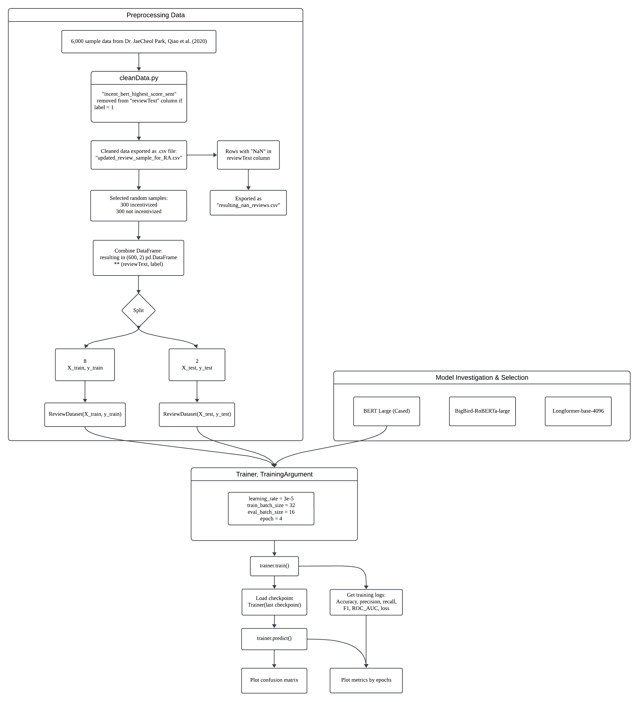

**Note:** This repository is associated with MISR UBC Data Analytics & AI Research Group

### <ins> Packages, files needed to run the program:  </ins>

- Numpy
- Pandas
- transformers
- scikit-learn
- torch
- matplotlib
- seaborn
- utils.py
- cleanData.py

### <ins> Preliminary </ins>

3 different state-of-the-art language models were investigated, and fine-tuned to classify incentivized reviews from a given dataset.
- Bidirectional Encoder Representation from Transformers (BERT), Large, cased
- BigBird_RoBERTa_large
- Longformer_base_4096

The main focus of choosing these models were based on the max_length (input)

Bidirectional Encoder Representations from Transformers (BERT) was used to predict whether a review is incentivized or not incentivized using imported dataset from . 

Review dataset having approximately 10,000,000 data with review texts and labels were used to train the pre-trained models.

labels having 0 or 1: 0 indicating not incentivized and 1 meaning incentivized


The <ins>main purpose</ins> of this repository is to **classifying and predicting incentivized sentences without using incentivized sentence**.

### <ins> Pre-processing Data </ins>

- Started with .csv file with 6,000 rows and 3 columns, where:
  - column 1 (reviewText): English review texts from a certain website
  - column 2 (labels): either 0 or 1
    - **label with 0** indicating that the corresponding reviewText is **not incentivized**
    - **label with 1** indicating that the corresponding reviewText is **incentivized**
  - column 3 (incentivized_sentence): "English incentivized review sentence" inside reviewText
    - i.e. English sentence with highest probability of being incentivized sentence
- .csv file converted as Pandas DataFrame, then **incentivized sentences from column 3** were removed from column 1.
- Column 3 dropped
- Training and testing data splitted (9 : 1 Ratio) using sklearn.model_selection (train_test_split)

### <ins> Training: </ins>
- Custom dataset (ReviewDataset) object created using splitted training and testing datasets
- 3 different models chosen, (base model used to develop code blocks : BERT_Large_cased)
  - BERT_Large_cased (maximum token input: 512 tokens)
  - Bigbird_RoBERTa_large (maximum token input: 4096 tokens)
  - Longformer_base_4096 (maximum token input: 4096 tokens)
- Trainer, TrainingArguments from transformers package was used to train pre-trained model.

```python
# Example of Trainer usage:
trainer = Trainer(
    model=model,                            # BertForSequenceClassification.from_pretrained('bert-large-cased', num_labels=2)
    args=training_args,
    train_dataset=training_dataset,
    eval_dataset=test_dataset,
    tokenizer=tokenizer,                    # BertTokenizer.from_pretrained('bert-large-cased')
    compute_metrics=compute_metrics,        
)
```

- As training argument, number of epochs were limited to 4, and hyperparameters such as learning rate, train batch size and eval batch size were altered to fine-tune the model.
- In summary, number of epochs set to 4, then accuracy, precision, recall, f1, roc_auc were the variables of interest during training stage.

### <ins> Process of the Workflow: </ins>



### <ins> Hyperparameter Tuning: </ins>

Overall, the best hyperparameters throughout the entire experiment were:

- learning_rate = 3e-5
  - Range tested: 1e-7 ~ 7e-5
- per_device_train_batch_size=32
  - Range tested: 8 ~ 64
- per_device_eval_batch_size=16
  - Range tested: 8 ~ 32
- adam_beta1=0.9
  - Range tested: 0.9 ~ 0.93
- adam_beta2=0.999
  - Range tested: 0.99 ~ 0.999

The focus of the experiment when altering hyperparameters were learning_rate, per_device_train_batch_size and per_device_eval_batch_size.

Initially, hyperparameters were set to:

- learning_rate = 7e-5
- per_device_train_batch_size = 8
- per_device_eval_batch_size = 4

to check that the program runs successfully without any error, then hyperparameters were tuned for more higher metric values and lower cross entropy loss.

### <ins> Plotting: </ins>

6 different plots were programmed to be plotted in this code (Accuracy, Precision, Recall, F1 Score, ROC_AUC and Confusion Matrix)

$$
Accuracy = \frac{TP + TN}{TP + TN + FP + FN}
$$

$$
Precision = \frac{TP}{TP + FP}
$$

$$
Recall = \frac{TP}{TP + FN}
$$

$$
F1 = 2 \times \frac{Precision \times Recall}{Precision + Recall}
$$

$$
ROCAUC = \frac{FP}{FP + TN}
$$


### <ins> Further Studies: </ins>

To check whether the model is being trained efficiently and accurately, several things can be considered further:

- Loss gradient (optimization):
  - I want to further investigate if plotting a 3D cross entropy loss would be possible in this case. 
  
- RAG : would it be possible to generate "incentivized" and "not incentivized" reviews, ... 
- K-nearest-neighbors :
  - When masking the "incentivized sentence" within the "incentivized review text" 
 
